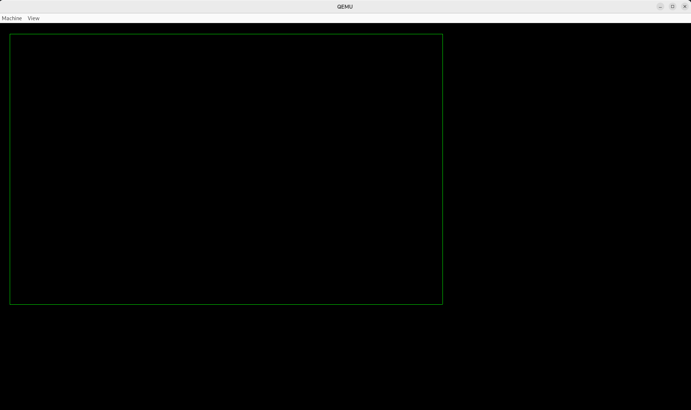
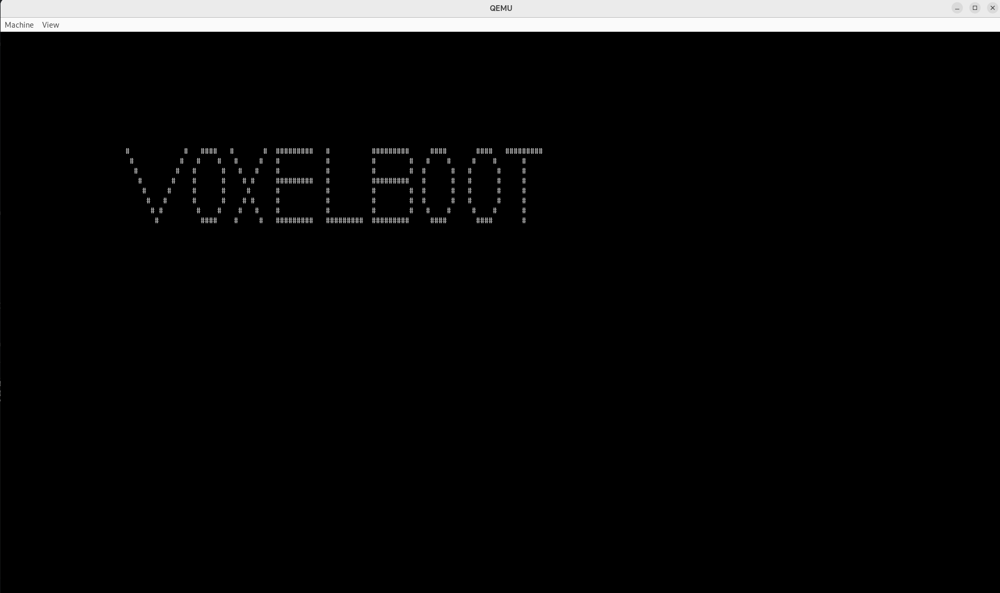

=====================================
Operating system (MagmaCubeOS) README
=====================================

The idea of this project is to do a OS with basic stuff.

Things that covered:

-working on x64 processor architecture
-working bootloader
-working kernel entry
-basic forward UEFI GOP parameters to kernel
-basic screen manipulation in kernel

Things not covered:

-memory allocation algorithm
-memory release algorithm
-screen fonts
-PS/2 port implementation
-USB port implementation
-Audio implementation
-Network stack implementation

========
BUILDING
========

1. You will need lib GNUEFI lib from debian repo
.. code-block:: shell
sudo apt install gnu-efi

2. Make folder build in project folder
and open a terminal in project folder and tap "make".

The compilation process should begin

3. If the compilation process end up with succed
you will have in build folder file "MagmaCubeOS.img"

MagmaCubeOS.img is containing
- bootloader for UEFI standard
- kernel thats work with only this bootloader

=======
TESTING
=======

I suggest to use qemu with UEFI.

recommended command for qemu on debian:

.. code-block:: shell

   /home/xxx/directory_to_qemu_folder/qemu-system-x86_64 \
  -M pc \
  -m 2G \
  -smp 3 \
  -cpu qemu64 \
  -net none \
  -drive if=pflash,format=raw,readonly=on,file=./OVMF_CODE.fd \
  -drive if=pflash,format=raw,file=./OVMF_VARS.fd \
  -drive file=./MagmaCubeOS.img,format=raw \
  -boot d \
  -display gtk \
  -monitor tcp:127.0.0.1:4444,server,nowait \
  -serial stdio \

==================
SUPORTED PLATFORMS
==================

Makefile support at this moment compilation on debian 12.
Any other OS that is compatibile with this OS should be working.

At this moment i don't support compilation on windows and
virtualizing MagmaCubeOS.img on virtualbox
